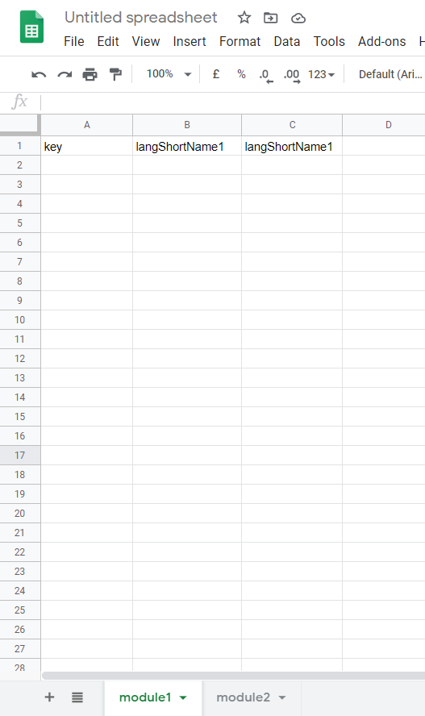
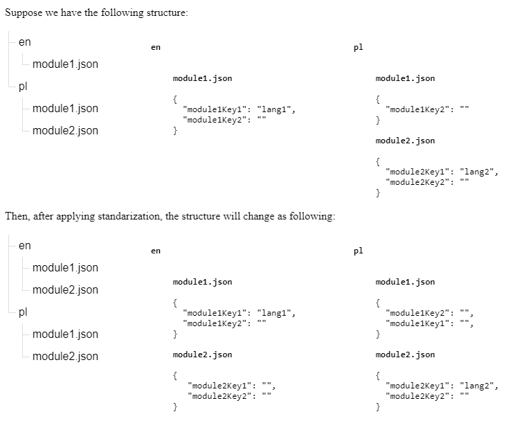
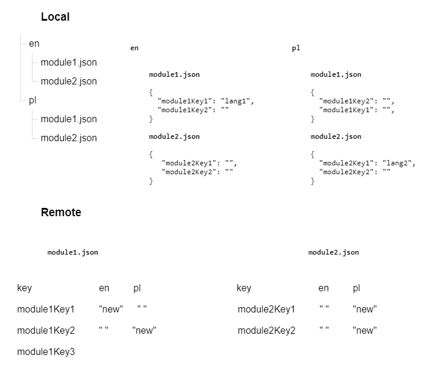
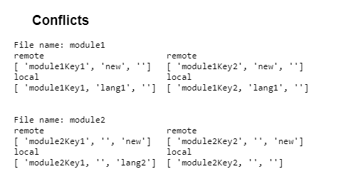

[](https://travis-ci.org/Lacrit/locman)

Simple plugin that aims to help with maintenance of remote translation files.
We usually store keys and translations in JSON and we want translators to do their work independently, without having to access the repository.

For this, we can flatten the local JSON structure and push it to Google spreasheets, so that structure like this: 

``` 
...
└── public
    └── locales
        ├── langShortName1
        │   ├── module1.json
        │   ├── module2.json
        │   └── ...
        ├── langShortName2
        │   ├── module1.json
        │   ├── module2.json
        │   └── ...
        └── ...
```

translates to this



It works also backwards, so whenever someone add a translation to a specific key and language, we can pull it back to the code.

So in short it helps with synchronizing those translations into files that translators can easily operate on and then merge it back whenever there is a new translation.

**Pleasem beware that it is a work in progress, so some features, like adding a new language are still missing and can only be done manually. Pull requests are welcome**

## Setup 

* Download your [credentials.json](https://developers.google.com/sheets/api/quickstart/nodejs) and place it in the root of your project.
* Create a file containing the spreadsheetID using **init** command. This ID is the value between the `/d/` and the `/edit` in the URL of your spreadsheet.

The *token.json* will be generated based on your credentials after the first request is made.

**Remember to add `creadentials.json` and `token.json` to *.gitignore*.**

***

## Structure 

On the root of the project you need to have `public/locales` folder where you keep the language subfolders with json modules later used by intl.

It should have the following structure: 

``` 
...
└── public
    └── locales
        ├── langShortName1
        │   ├── module1.json
        │   ├── module2.json
        │   └── ...
        ├── langShortName2
        │   ├── module1.json
        │   ├── module2.json
        │   └── ...
        └── ...
```

### Assumptions

* There cannot be a key named 'key'

* You can`t add new languages after first push (not yet implemented*)

* Supports modules to be nested JSON's

***

## Usage

`locman command [-o|spreadsheetID]`

- `-o` stands for *override* 

***

## Available commands

* **push** — *standardizes* local data, creates and deletes sheets if needed and *merges*/*overrides* the data with the spreasheet (takes an optional argument `-o`)
* **pull** — *standardizes* local data, creates and deletes json modules if needed and *merges*/*overrides* the data locally (takes an optional argument `-o`)
* **init** — creates the file containing spreadsheetID (takes `spreadsheetID` as an argument)
* **diff** — *standardizes* local data, shows the difference between sheets and your local modules

***

## Standarization

* Adds missing keys if any, i.e. if the keys weren't added to every translation module
* Adds missing modules if any, i.e. if the modules weren't added to every language subfolder 

### Example 



***

## Merge 

Incorporates row changes if there are no conflicts, otherwise allows to resolve each *conflict* individually.

### Example data



_**Conflict**_ appears whenever the translation for the key, that exist both locally and in the spreadsheet, was changed.

### Example conflicts



***

## Override

Force pushing or pulling changes.

## Diff 

Shows every sheet existing in the spreadsheet highlighting changed translations, added keys and files.
